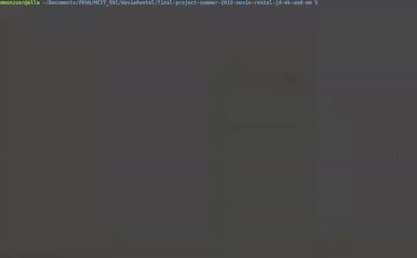
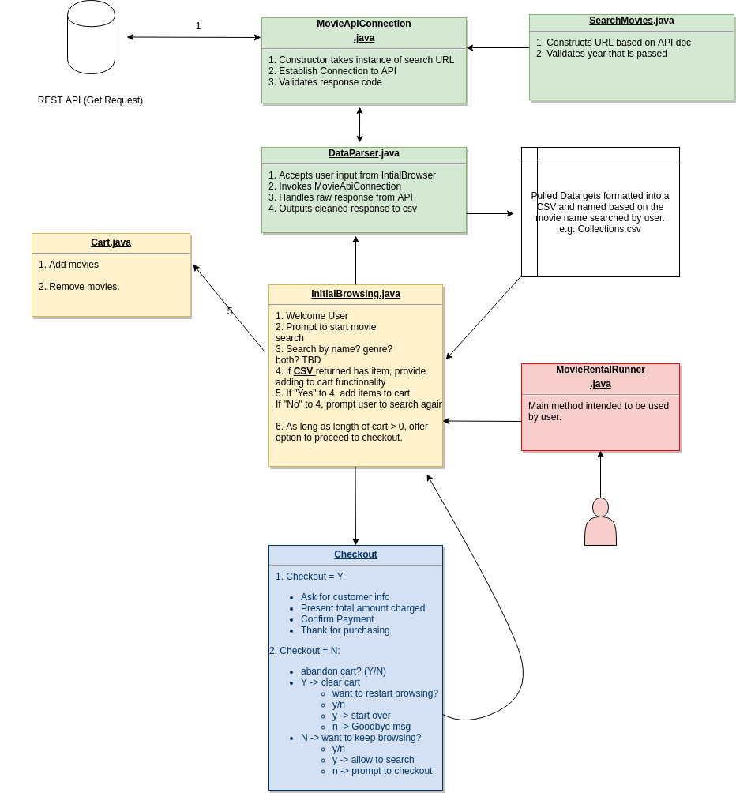
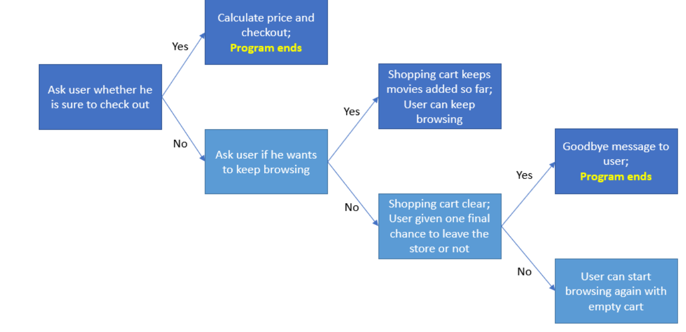

# Virtual Movie Rental Store
 
###### Authors: JD, NK, MM

## Summary

The summary of this project and corresponding role breakdown can be found [here](summary.txt).
 
## Usage

Please note, this application needs to connect to an API and **requires internet connection**. Cannot run this project offline.
 
Run the following class after compiling to be prompted as a user to navigate the store:
 
```java MovieRentalRunner.java```
 
This should prompt you with a title to search. You can put a name of a movie, e.g. batman, captain america, etc. Once a title is accepted, you will be prompted for a year. If you put a valid date, it will be used to search. If you put nothing or random strings, your year value will be ignored since it is an optional search field. See example usage run through below:
 


1. Prompted to search by a movie **title**
2. Once title has been passed, option to search by **year** is passed
3. List of movies are provided. Use index number of movies to input into **cart**.
4. Option to view items in the Cart, **add**, or **remove** items are provided.
5. Checkout option by providing user the **total price** or the ability to go back to browsing. 
 
The Cart functionality allows for seamless movements of units in and out for the user. The usage example shows the ability to add items to the cart based on number on the list. However, when you are viewing your cart, you can also drop items that you no longer want to checkout from the store with.
 
Checkout covers a broad range of decisions from the user and allows for the individual to go back to browsing for more movies if they want to. The user is not "stuck" with having to checkout their items once that class has been invoked. This is a feature that mimics what we see in a lot of e-commerce sites and having this functionality matches closely with our initial objective (see section below).
 
### Background & Objective
 
Our objective for this project is to create a virtual movie rental store that allows customers/ users to go through a full shopping experience. We aim to encompass the user experience flow of entering a virtual store such as browsing a catalogue, adding or discarding items from a shopping cart, proceeding to checkout, and getting issued a receipt of rental. The main inspiration for this project is a practical one. In the era of Shopify, Etsy, and other e-commerce platforms dominating the consumer market, we think it is import to delve into learning the basics around prototyping such platforms and understanding the user interaction. Due to various limitations, we will be keeping the scope of this project concise.  For example, we are not exploring the areas of payment authentication, data science/ analytics based recommendations algorithms, etc. However, we do understand that these are potential areas of enhancement one can explore at length if provided the opportunity.
 
This project has been created with the user as a key priority. When the user enters our store, they will need to search a catalogue of available movies to first see what is available to rent. We will be starting out by creating this catalogue database by fetching related data from a public API such as the [OMDb API](https://www.omdbapi.com/). Using this RESTful API, we will be making GET requests. The API requires the registration of the user to a free account in order to generate an API key for authentication. Once the data is fetched, we will convert the elements of the data to our desired .csv format and keep the needed items. The search is generated based on user inputs which is a component discussed extensively below.
 
### Design

#### Summary of Project Design
 


#### Design Breakdown 

The design starts with the user interacting with our browser class ```InitialBrowsing.java```. This is the main class handling user inputs, offering options, and providing lists of movies available for renting. The user searches taken in by this class as inputs are then sent to the ```DataParser.java``` class where it gets converted to url format. A search url is constructed using the ```SearchMovies.java``` class. Finally, a connection is established with the main API, using our registered API key which is already embedded in the search URL with the ```MovieAPIConnection.java``` class. The results are saved in a csv that are returned by the API.
 
```InitialBrowsing``` class is now able to parse the saved csv and return to the user a series of choices to rent with the price included. The user can continue browsing, add elements to their cart, and decide to checkout from the store at this point. Once there are items in the cart, the user can input checkout choice which invokes the ```Checkout.java``` class. The ```Checkout.java``` class totals the bill and gives the user the option to go back to browsing or finish purchasing. After the purchase has been made, the application closes. The decision tree below explains the design flow of the Checkout class:



 
### Summary of Features
 
Carrying out the design described above requires implementation of modular features so we can always be aware of dry,coupling, and cohesion.
 
1. MovieApiConnection - establishes get request for the movie searched
2. SearchMovies - ability to search movie
3. DataParser - parses json into arrayList for consumption by InitialBrowsing
4. InitialBrowsing - User interaction class
5. Cart - class used to add items or remove items from users cart
6. Checkout - checkout the items in cart
 
### License
 
##### OMDB API Credits
Author: API by Brian Fritz.
API Content License: All content licensed under CC BY-NC 4.0.
 
 
 
 

