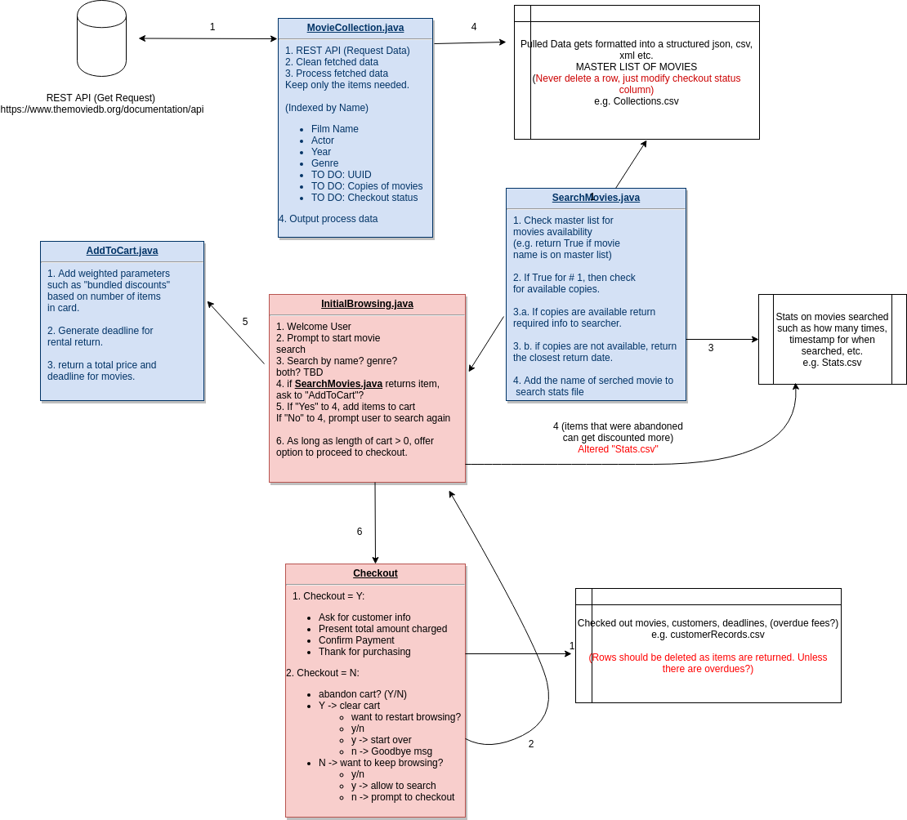

# Virtual Movie Rental Store

###### Authors: JD, NK, MM

### Objective

Our objective for this project is to create a virtual movie rental store that allows customers/ users to go through a full shopping experience. We aim to encompass the user experience flow of entering a virtual store such as browsing a catalogue, adding or discarding items from a shopping cart, proceeding to checkout, and getting issued a receipt of rental. The main inspiration for this project is a practical one. In the era of Shopify, Etsy, and other e-commerce platforms dominating the consumer market, we think it is import to delve into learning the basics around prototyping such platforms and understanding the user interaction. Due to various limitations, we will be keeping the scope of this project concise.  For example, we are not exploring the areas of payment authentication, data science/ analytics based recommendations algorithms, etc. However, we do understand that these are potential areas of enhancement one can explore at length if provided the opportunity. 

This project has been created with the user as a key priority. When the user enters our store, they will need to search a catalogue of available movies to first see what is available to rent. We will be starting out by creating this catalogue database by fetching related data from a public API such as the [OMDb API](https://www.omdbapi.com/). Using this RESTful API, we will be making GET requests. The API requires the registration of the user to a free account in order to generate an API key for authentication. Once the data is fetched, we will convert the elements of the data to our desired .csv format and keep columns such as genre, actors, year released, title, etc. This dataset will be the “inventory” of our store. We will generate various copies for each film that will be available for users to pick up.

### Design

In order to browse the Catalogue and get data on which movies are owned by the store, movies that are owned but already rented, and movies that are actually available, a search feature needs to be created. The search feature will allow users to look for movies but it will collect underlying data on what is being searched to apply a very simple demand pricing calculation. For example, if “Pulp Fiction” was searched 20 times by users and “The Godfather” was searched 50 times, “Pulp Fiction” can be inferred to have a lower demand. This would mean that we will lower the price of rental for “Pulp Fiction” by a certain threshold. 

The user needs to be able to pick up movies as they are browsing and this would require creating an “Add to Cart” feature. At any point during the shopping process, users should have the ability to remove items, check and see what the total bill is, and add more items to their cart. Being able to just “Abandon Cart” is also a key feature that needs to be accounted for here. The pricing model explained earlier would be added dynamically to the shopping cart along with “bundled discounts” (e.g. $1 off for 2 movies, $4 off for 6 movies, etc.) throughout the shopping experience. When the user is satisfied, they should be able to proceed to checkout with the items in their cart. 

Since this is a movie rental store and not a movie purchasing store, the checkout receipt needs to provide the user with a deadline to return the films. It is also important to have some estimation on the fines that can incur daily if the items are not returned on time. The payment aspect of the checkout process will be a message confirmation which will be followed by giving the customer their receipt. As the customer is exiting the store, there will be a thank you message and a graceful closing of the application. 



### Features

Carrying out the design described above requres implementation of modular features so we can always be aware of coupling and cohesion. 

1. MovieApiConnection - establishes get request for the movie searched
2. SearchMovies - ability to search movie
3. DataParser - parses json into arrayList for consumption by InitialBrowsing
4. InitialBrowsing - User interaction class
5. AddToCart - class used to add items to users cart
6. RemoveFromCart - option to remove items from cart
7. Checkout - checkout the items in cart

## Usage

### Tahin's part:

To simply search for a movie, compile ```DataParser.java``` and run the file. It should prompt you for a movie title, and then give you the option to input a year. Based on a valid search, you will get a .csv file as an output. 

These prompts are temporary and will become one with Nami's user interaction function once we integrate our code together later this week. 


